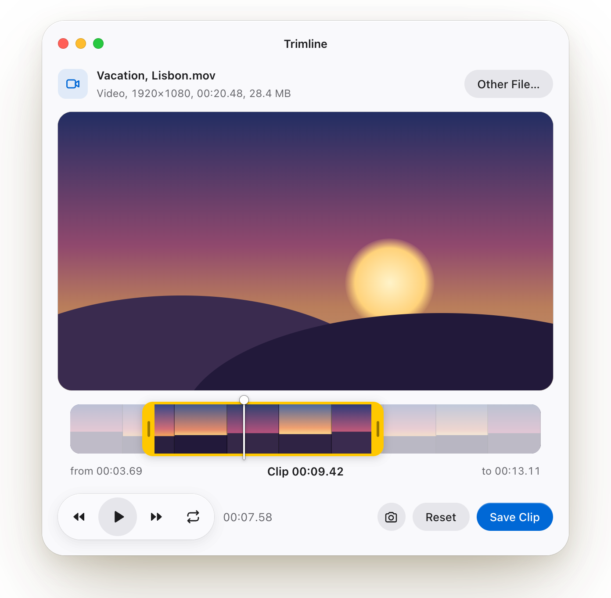
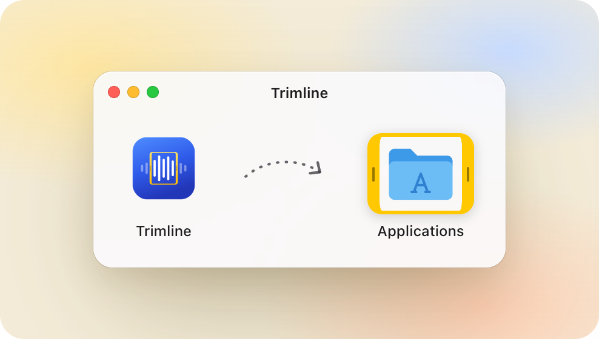
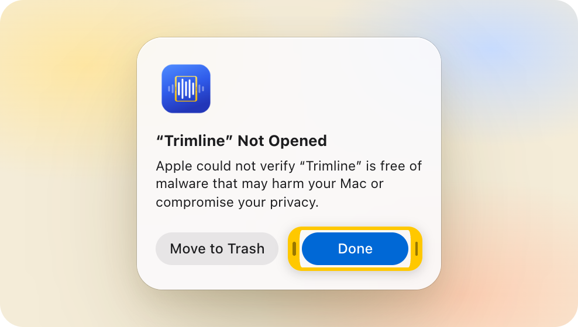
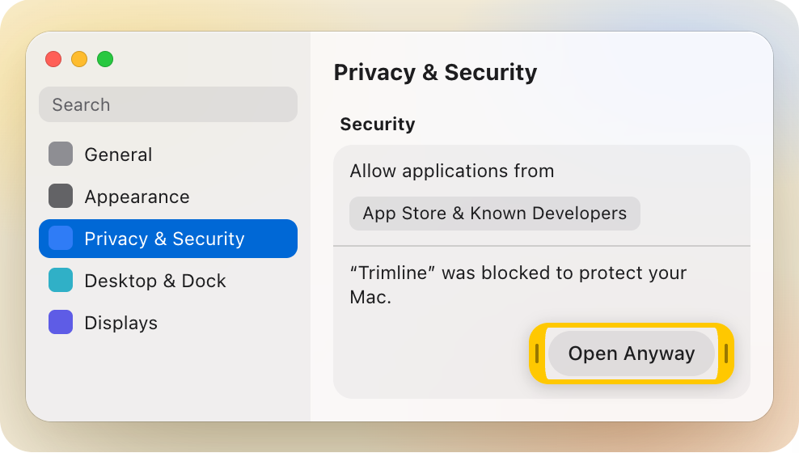
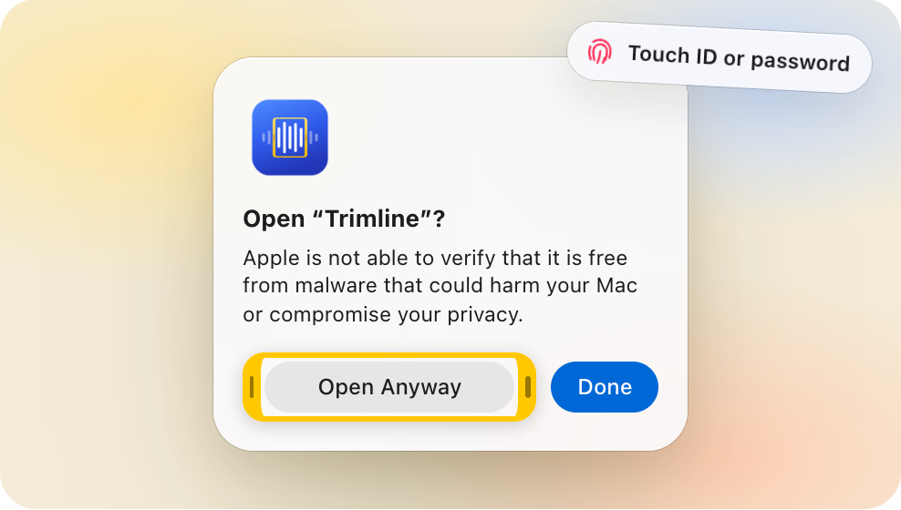

# Trimline

<p align="center">
  <a href="https://github.com/ArtuhovichVladislav/Trimline/releases/latest/download/Trimline.dmg"><b>⬇&nbsp;Download Trimline.dmg</b></a>
  &nbsp;·&nbsp; free and open source &nbsp;·&nbsp; macOS 14+ &nbsp;·&nbsp; Apple silicon and Intel
  <br>
  <sub>Not notarized: on first launch allow it in System Settings ▸ Privacy &amp; Security ▸ Open Anyway (<a href="#first-launch">how</a>).</sub>
</p>

A small native macOS app that trims audio and video without re-encoding: open a file, select a fragment on the
timeline, save it as a new file. Website: [trimlineapp.github.io](https://trimlineapp.github.io/).

<p align="center">
  <picture>
    <source media="(prefers-color-scheme: dark)" srcset="docs/images/trimline-window-dark.png">
    
  </picture>
</p>

## Features

- Opens almost any audio or video file: MP4, MOV, MKV, WebM, AVI, WMV, FLV, MTS, MPG, MP3, M4A, FLAC, WAV, Ogg,
  Opus, WMA and more. AVFoundation handles Apple's formats; a trimmed-down FFmpeg build handles the rest.
- Lossless by default: streams are copied, so even a large file is saved in seconds at the original quality. MP4
  and MOV are cut to the exact frame.
- Optional exact-frame cutting for other containers (Settings ▸ "Cut video to the exact frame"), with a smart cut
  that re-encodes only a few frames around the cuts for H.264 and HEVC.
- Keeps audio tracks, subtitles, chapters, metadata and rotation wherever the format allows; can save video only
  or sound only.
- Timeline with thumbnails or a waveform, zoom, frame-by-frame keys, undo, and a selection remembered per file.
- Saves or copies the current frame as PNG.
- Finder integration: Open With and a "Trim in Trimline" service.
- 12 languages; about 24 MB installed; no telemetry.

## Download

Get the latest `Trimline.dmg` from [GitHub Releases](https://github.com/ArtuhovichVladislav/Trimline/releases/latest),
open it and drag Trimline to Applications. Run it from Applications so it can update itself.

Requirements: macOS 14 Sonoma or later, Apple silicon or Intel.

### First launch

Trimline is signed ad hoc and not notarized, so macOS asks you to allow it the first time. On macOS 15 Sequoia and
later that takes four steps, once; updates installed through Sparkle don't ask again.

**1. Move it to Applications.** Open `Trimline.dmg` and drag Trimline onto the Applications folder. Always start it
from there: when it runs from the disk image or Downloads, it can't update itself.

<picture>
  <source media="(prefers-color-scheme: dark)" srcset="docs/images/install-step1-dark.png">
  
</picture>

**2. Open it, then click Done.** macOS says it can't verify the app. Click **Done**, not Move to Trash.

<picture>
  <source media="(prefers-color-scheme: dark)" srcset="docs/images/install-step2-dark.png">
  
</picture>

**3. Allow it in Privacy & Security.** Open System Settings ▸ Privacy & Security, scroll down to Security and click
**Open Anyway** next to "“Trimline” was blocked to protect your Mac". The button stays there for about an hour.

<picture>
  <source media="(prefers-color-scheme: dark)" srcset="docs/images/install-step3-dark.png">
  
</picture>

**4. Confirm once.** Click **Open Anyway** again and confirm with Touch ID or your password.

<picture>
  <source media="(prefers-color-scheme: dark)" srcset="docs/images/install-step4-dark.png">
  
</picture>

On macOS 14 Sonoma it's simpler: Control-click Trimline in Applications, choose Open, then click Open again.
Prefer Terminal? After moving the app to Applications, this does the same as steps 2–4:

```sh
xattr -dr com.apple.quarantine /Applications/Trimline.app
```

## Privacy

Trimline collects no telemetry and needs no account. It connects to the internet only to check for and download
updates from this repository's releases; the check sends no personal data, only the app version. Automatic checks
can be turned off in Settings ▸ Updates.

## Build from source

Requires Xcode 26 and [Homebrew](https://brew.sh):

```sh
brew install nasm pkg-config meson ninja ffmpeg
./scripts/build-ffmpeg.sh                 # FFmpeg and dav1d frameworks, once, ~15 min
open Trimline.xcodeproj                   # run the Trimline scheme
swift test --package-path TrimlineCore    # tests
```

Details, command-line builds and formatting: [`docs/building.md`](docs/building.md).

## Documentation

- [`docs/spec.md`](docs/spec.md): what the app does, formats, keyboard, settings, performance targets.
- [`docs/architecture.md`](docs/architecture.md): repository layout, how the code is organized, where to change what.
- [`docs/building.md`](docs/building.md): building from source, tests, formatting.
- [`docs/decisions/`](docs/decisions/): why things are the way they are.
- [`docs/release.md`](docs/release.md): releasing, Sparkle keys, signing, CI.
- [`docs/test-media.md`](docs/test-media.md): the manual test media set.

## License

Trimline is released under the MIT License, see [`LICENSE`](LICENSE). It bundles FFmpeg (LGPL 2.1 or later,
linked dynamically), dav1d (BSD 2-Clause) and Sparkle (MIT); see
[`THIRD_PARTY_NOTICES.md`](THIRD_PARTY_NOTICES.md). The exact FFmpeg and dav1d sources and build script are
attached to every release.
